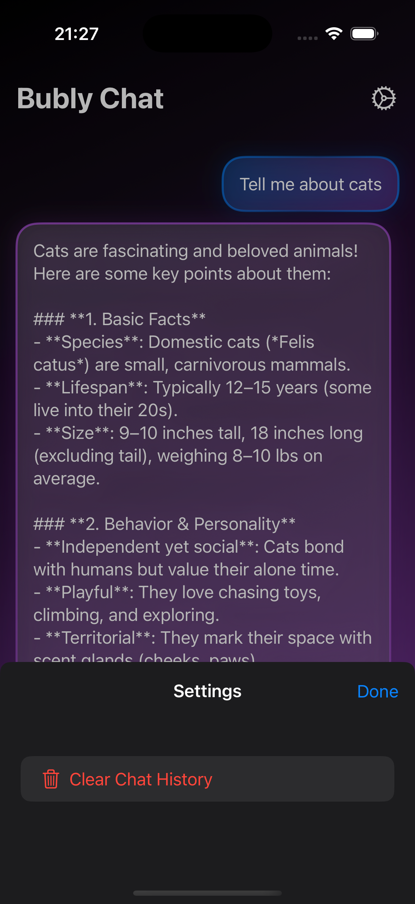

# Bubly Chat

A modern, friendly AI-powered chat app for iOS.  
Beautiful gradients, smooth animations, accessibility, and a delightful user experience — all in one open-source SwiftUI project.

---

## ✨ Features

- **Conversational AI** — Powered by DeepSeek API
- **Modern UI** — Gradient backgrounds, smooth message animations, and haptic feedback
- **Accessibility** — Full VoiceOver support and Dynamic Type
- **Chat History** — Messages are saved between sessions
- **Quick Commands** — Instantly send example prompts
- **Message Management** — Copy, share, or delete your messages
- **Dark & Light Mode** — Looks great in any theme
- **Settings** — Clear chat history and more

---

## 📸 Screenshots

<div align="center">
  
  
  
</div>

The screenshots showcase:
- Beautiful gradient background transitions
- Modern message bubble design
- Clean typography and spacing
- Settings interface with clear chat functionality
- Dark mode support for comfortable viewing

---

## 🚀 Getting Started

1. **Clone the repository**
   ```sh
   git clone https://github.com/yourusername/bubly-chat.git
   cd bubly-chat
   ```
2. **Open in Xcode**  
   Open `test.xcodeproj` in Xcode 15+.

3. **Add your DeepSeek API key**  
   Create a file `Config.swift` in the project root:
   ```swift
   import Foundation

   enum Config {
       static let apiKey: String = "your-api-key-here"
   }
   ```
   > **Note:** Never commit your API key to a public repository!

4. **Build and run**  
   Select a simulator or device and press ⌘R.

---

## 🛠️ Technologies

- Swift 5.9+, SwiftUI
- DeepSeek API
- Haptic Feedback
- Dynamic Type & Accessibility
- UserDefaults for chat history

---

## ♿ Accessibility

- Full VoiceOver support for all interactive elements
- Dynamic Type for readable, scalable text
- High-contrast color schemes for both light and dark mode

---

## 🎨 Design

- Gradient backgrounds and message bubbles
- Smooth, springy animations for message appearance
- Custom loading indicator (pulsing dots)
- Modern, friendly icon and branding

---

## 📋 Roadmap

- [ ] Multi-language support
- [ ] Customizable themes
- [ ] Siri Shortcuts integration
- [ ] Achievements and usage stats

---

## 🤝 Contributing

Pull requests are welcome!  
For major changes, please open an issue first to discuss what you would like to change.

---

## 📬 Feedback

Have ideas or found a bug?  
Open an issue or email [your@email.com](mailto:your@email.com).

---

## 📄 License

This project is licensed under the MIT License — see the [LICENSE](LICENSE) file for details.

---

